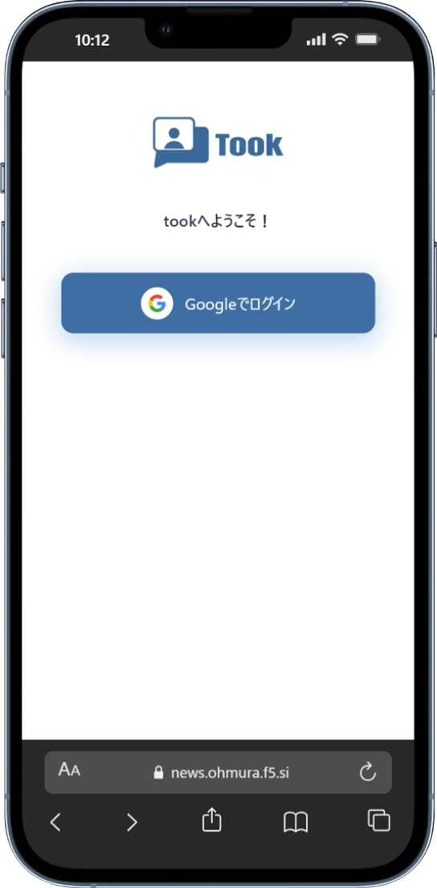
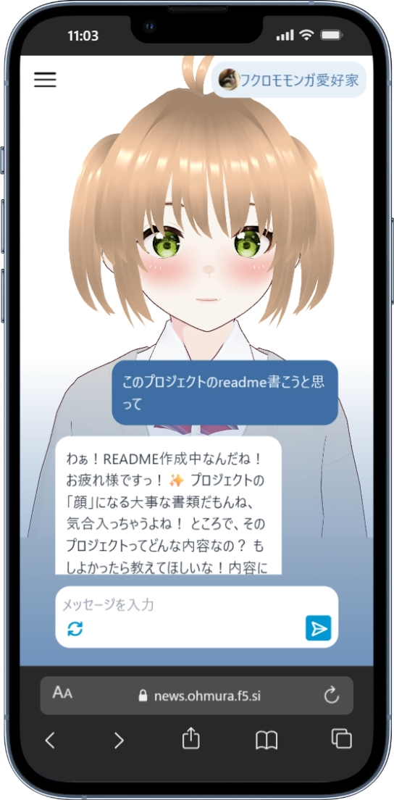
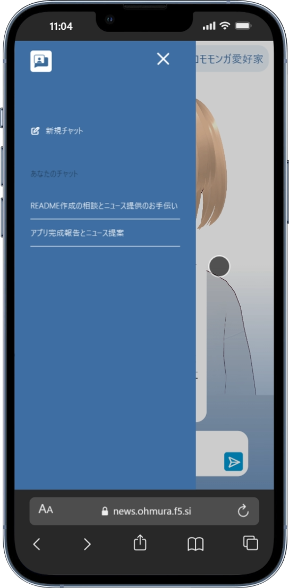
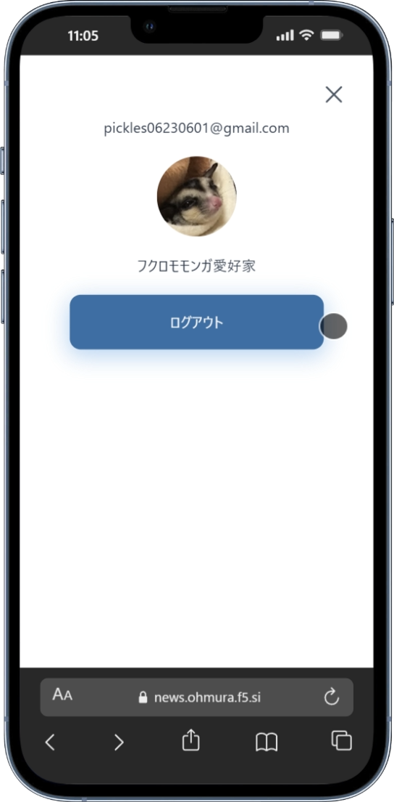

# ニュース取得アシスタントAI "took"

    
    
    
    

## 使用スタック

### frontend

- ***[AITuberKit](https://github.com/tegnike/aituber-kit)*** 3Dモデルの表示、リップシンク、テキストデータからの発話
- ***Next.js***
- ***TypeScript***
- ***Tailwind CSS***

### backend

- ***Laravel*** 認証認可、CRUD
    + Laravel Sanctum
    + Laravel Socialite
    + MySQL

- ***FastAPI*** AIによる返答を生成
    + Google Gen AI SDK
    + Beautiful Soup
    + Playwright

### infrastructure

- ***nginx*** リバースプロキシ
- ***Cloudflare Tunnel*** TTSでGPUを使いたく自宅のPCで動かすため
- ***Docker Compose***

## 振り返り

- Googleアカウントでログインできるようにした
- PythonのGoogle Gen AI SDKが機能が豊富だったからFastAPIを使ってコンテナを作った
- 時間のかかる処理にはローディングのアニメーションを表示するようにした
- voiceboxでの音声合成がCPUだと遅かったからGPUを使ったら断然早かった
- ポートフォリオにするためにREADMEを書いてみて、このプロジェクトで一番難しかったが、できたものを見てみると大したことなくて悲しい
